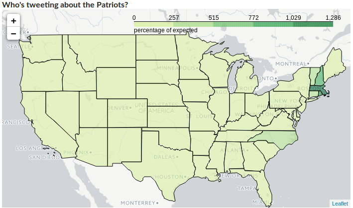
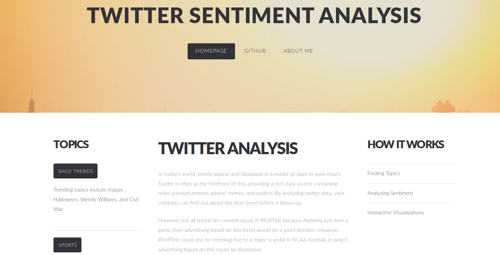

## Twitter Sentiment Analysis
Analyzes trending topics by sentiment and location, and provides easy to understand visualizations of the results.

### Synopsis
This program allows you to analyze either preselected topics, or the latest trends on twitter.  It uses a sentiment analysis algorithm to determine the sentiment relating to a topic in real time, where the tweets are coming from, and how each part of the country feels about a given topic. The results of this are then shown on an interactive map.



### Web Application: twittersentimentanalysis.com

At twittersentimentanalysis.com, you can see analysis of how america felt about the patriots, roll tide, and the latest daily trends on twitter (updated twice daily).



### Data Source

The training data was taken from [Sanders Analytics](http://www.sananalytics.com/lab/twitter-sentiment/) which classified 1.6M tweets by emoticon.   The state gis files were found from the [US Census](http://www2.census.gov/geo/tiger/GENZ2016/shp/cb_2016_us_state_20m.zip).   The actual tweets were scraped using tweepy to access the twitter streaming API.  

The data was stored using MongoDB.


### Description

```
├── src
|   ├── model.py (model for predicting sentiment of tweets)
|   ├── mongo.py (functions for connecting to mongodb)
|   ├── neural_networks.py (CNN and RNN models for analyzing tweet sentiment)
|   ├── process_tweets.py (model for processing tweets and tweet collections by finding sentiment and location)
|   ├── twitter_scraper.py (functions for finding trends, and scraping tweets by topic)
|   ├── visualization.py (functions for creating map visualizations of sentiment and count) 
|   └── utils.py (functions for text preprocessing)
|
├── website
|   ├── *_template.html (templates with daily topics to be filled in via jinja2) 
|   ├── *.html (html website pages) 
|   └── maps (leaflet.js maps of sentiment and frequency of tweets)
|
├── models
|   ├── stemmed_lr.pk (pickled src.model.Model class consisting of stemmed_words+tfidf+logistic regression)
|   ├── unstemmed_lr.pk (pickled src.model.Model class consisting of tfidf+logistic regression)
|   └── naive_bayes.pk (pickled src.model.Model class consisting of bag of words+naive bayes)
|
├── test
|   ├── process_tweets_unittests.py
|   ├── twitter_scraper_unittests.py
|   └── utils_unittests.py
|
└── README.md
```

### Required Packages
The required packages can be found in requirements.txt.  They are
  - Folium: generates interactive html maps generated from python
  - Tweepy: twitter scraping API frontend
  - Sklearn
  - pandas
  - geopandas: pandas with geojson, arcgis, etc support
  - Tensorflow
  - re
  - BeautifulSoup
  
